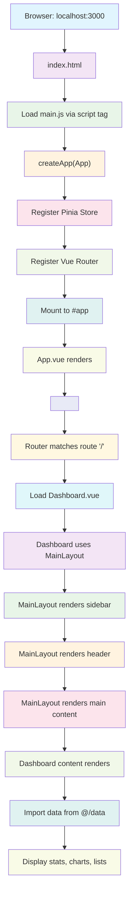
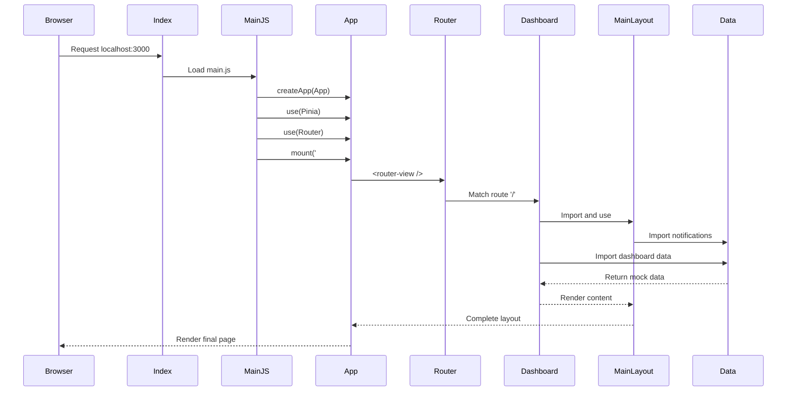

# Healthcare Management - Execution Flow Diagram

## 🔄 Flow Execution Order (localhost:3000)



## 📋 Detailed Execution Steps

### Phase 1: Application Bootstrap
1. **index.html** - Entry point HTML file
2. **main.js** - Vue app initialization
3. **App.vue** - Root component with router-view

### Phase 2: Routing & Component Loading
4. **router/index.js** - Route configuration
5. **Dashboard.vue** - Main dashboard component
6. **MainLayout.vue** - Layout wrapper component

### Phase 3: Data Integration
7. **data/index.js** - Central data export
8. **data/dashboard.js** - Dashboard statistics
9. **data/patients.js** - Patient data
10. **data/appointments.js** - Appointment data
11. **data/notifications.js** - Notification data

### Phase 4: Rendering
12. **Sidebar Navigation** - Menu items and navigation
13. **Header Section** - User info, notifications
14. **Dashboard Content** - Stats cards, charts, lists
15. **Interactive Elements** - Modals, forms, buttons

## ⚡ Performance Flow



## 🎯 Key Integration Points

### 1. **Data Flow**
- Mock data from `/src/data/` files
- Centralized exports through `index.js`
- Reactive data binding in Vue components

### 2. **Component Hierarchy**
```
App.vue
├── Router View
    └── Dashboard.vue
        └── MainLayout.vue
            ├── Sidebar
            ├── Header
            └── Main Content (Dashboard Content)
```

### 3. **State Management**
- Local component state with `ref()` and `reactive()`
- No global state (Pinia not actively used yet)
- Props and events for component communication

### 4. **Routing Logic**
- Default route: `/` → Dashboard
- Named routes for navigation
- Router-link components for navigation

## 🚀 Initialization Timeline

| Time | Component | Action |
|------|-----------|--------|
| 0ms | Browser | Request localhost:3000 |
| 10ms | index.html | Load HTML and scripts |
| 50ms | main.js | Initialize Vue app |
| 100ms | App.vue | Mount root component |
| 150ms | Router | Process route matching |
| 200ms | Dashboard.vue | Load dashboard component |
| 250ms | MainLayout.vue | Render layout structure |
| 300ms | Data files | Import mock data |
| 350ms | Components | Render final UI |
| 400ms | Page | Fully interactive dashboard |
