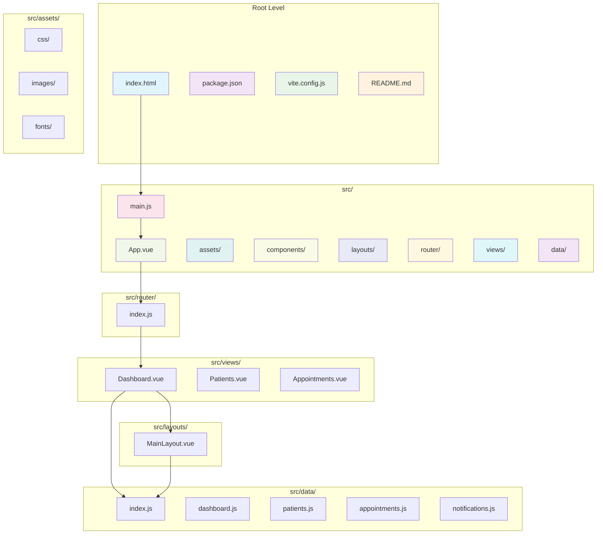
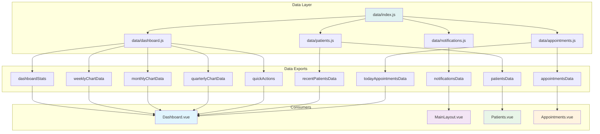
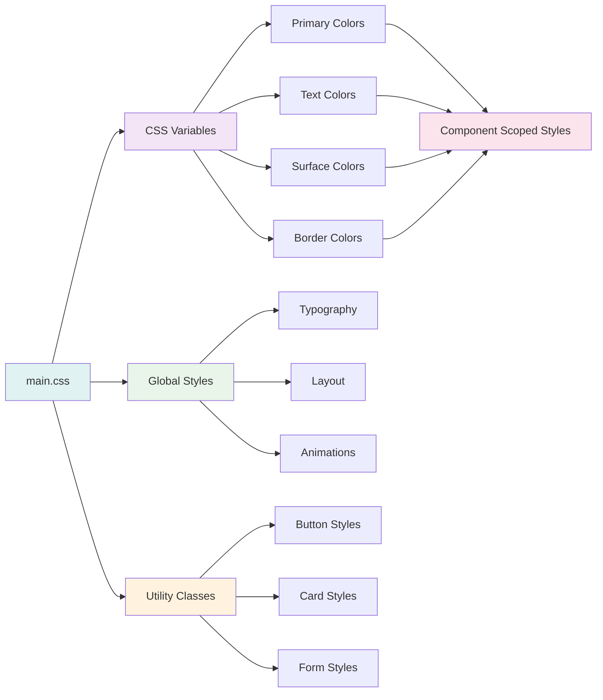
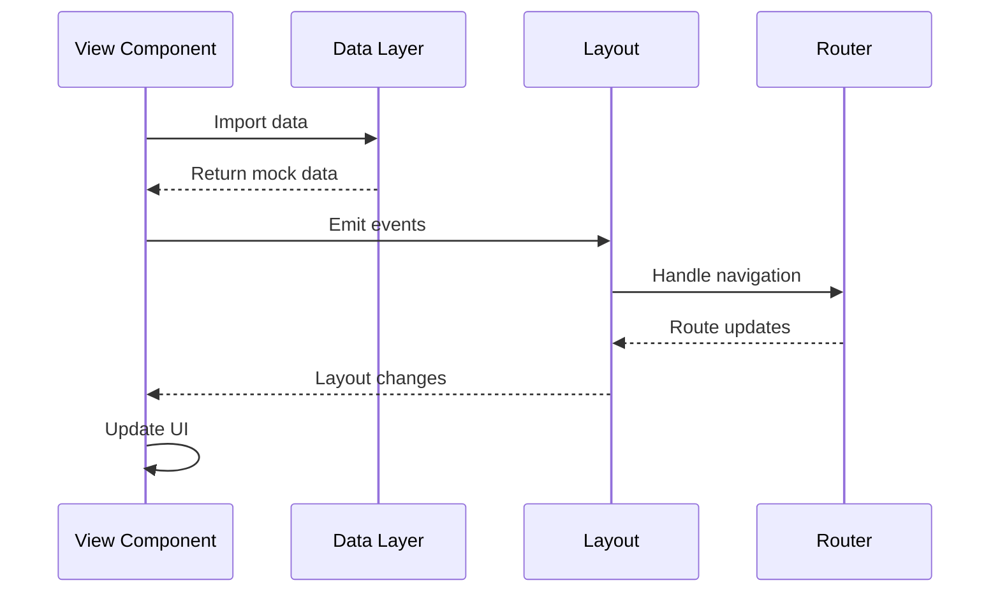

# Healthcare Management - Module Structure Diagram

## 🏗️ Project Architecture Overview



## 📁 Detailed Module Breakdown

### 1. **Root Configuration Files**

```
healthcare-management/
├── index.html              # Entry point HTML
├── package.json            # Dependencies and scripts
├── vite.config.js          # Vite configuration
├── README.md              # Project documentation
└── docs/                  # Documentation files
    ├── execution-flow.md  # Execution flow diagrams
    └── module-structure.md # Module structure docs
```

### 2. **Source Code Structure (`src/`)**

```
src/
├── main.js                 # Application entry point
├── App.vue                 # Root Vue component
├── assets/                 # Static assets
│   └── css/
│       └── main.css       # Global styles
├── components/             # Reusable Vue components
├── layouts/               # Layout components
│   └── MainLayout.vue    # Main application layout
├── router/                # Vue Router configuration
│   └── index.js          # Route definitions
├── views/                 # Page-level Vue components
│   ├── Dashboard.vue     # Dashboard page
│   ├── Patients.vue      # Patients management page
│   └── Appointments.vue  # Appointments management page
└── data/                  # Mock data and data layer
    ├── index.js          # Central data exports
    ├── dashboard.js      # Dashboard statistics
    ├── patients.js       # Patient data
    ├── appointments.js   # Appointment data
    └── notifications.js  # Notification data
```

## 🔗 Module Dependencies

```mermaid
graph LR
    subgraph "Core Dependencies"
        A[Vue 3]
        B[Vue Router]
        C[Pinia]
        D[Vite]
    end
    
    subgraph "UI Dependencies"
        E[Lucide Vue Next]
        F[@vueuse/core]
    end
    
    subgraph "Development Dependencies"
        G[@vitejs/plugin-vue]
        H[Sass]
    end
    
    subgraph "Application Modules"
        I[main.js]
        J[App.vue]
        K[Router]
        L[Views]
        M[Layouts]
        N[Data Layer]
    end
    
    A --> I
    B --> I
    C --> I
    D --> I
    E --> L
    F --> L
    G --> D
    H --> D
    
    I --> J
    J --> K
    K --> L
    L --> M
    L --> N
    
    style A fill:#42b883
    style B fill:#42b883
    style C fill:#42b883
    style D fill:#646cff
    style E fill:#ff6b6b
    style F fill:#ff6b6b
    style G fill:#ffd93d
    style H fill:#ffd93d
```
```mermaid
## 🎯 Component Hierarchy


graph TD
    A[App.vue] --> B[Router View]
    B --> C[Dashboard.vue]
    B --> D[Patients.vue]
    B --> E[Appointments.vue]
    
    C --> F[MainLayout.vue]
    D --> F
    E --> F
    
    F --> G[Sidebar Navigation]
    F --> H[Header Section]
    F --> I[Main Content Slot]
    
    H --> J[User Menu]
    H --> K[Notifications]
    H --> L[Page Title]
    
    G --> M[Menu Items]
    M --> N[Dashboard Link]
    M --> O[Patients Link]
    M --> P[Appointments Link]
    
    I --> Q[Dashboard Content]
    I --> R[Patients Content]
    I --> S[Appointments Content]
    
    Q --> T[Stats Cards]
    Q --> U[Charts]
    Q --> V[Lists]
    Q --> W[Quick Actions]
    
    style A fill:#e1f5fe
    style F fill:#f3e5f5
    style G fill:#e8f5e8
    style H fill:#fff3e0
    style I fill:#fce4ec
    style Q fill:#f1f8e9
```

## 📊 Data Layer Architecture



## 🔧 Configuration Files

### **package.json Dependencies**
- **Core**: Vue 3, Vue Router 4, Pinia
- **Build**: Vite 5, @vitejs/plugin-vue
- **UI**: Lucide Vue Next, @vueuse/core
- **HTTP**: Axios (for future API calls)
- **Styling**: Sass

### **vite.config.js**
- Vue plugin configuration
- Path alias (@ → src/)
- Development server port (3000)

### **Router Configuration**
- History mode routing
- Route definitions for Dashboard, Patients, Appointments
- Future routes: Medical Records, Billing (commented out)

## 🎨 Styling Architecture



## 🚀 Module Responsibilities

| Module | Responsibility | Key Features |
|--------|----------------|-------------|
| **main.js** | App initialization | Vue app setup, plugin registration |
| **App.vue** | Root component | Router view, global styles |
| **router/** | Navigation | Route definitions, navigation logic |
| **layouts/** | UI structure | Consistent layout across pages |
| **views/** | Page components | Specific page functionality |
| **data/** | Data management | Mock data, data layer abstraction |
| **assets/** | Static resources | CSS, images, fonts |

## 🔄 Data Flow Pattern



## 📋 Future Module Extensions

### Planned Modules:
- **stores/** - Pinia stores for global state
- **services/** - API service layer
- **utils/** - Utility functions
- **composables/** - Vue composables
- **middleware/** - Route guards and middleware
- **types/** - TypeScript definitions (if migrating to TS)

### Integration Points:
- API integration in services/
- Global state management in stores/
- Shared logic in composables/
- Type safety with TypeScript
